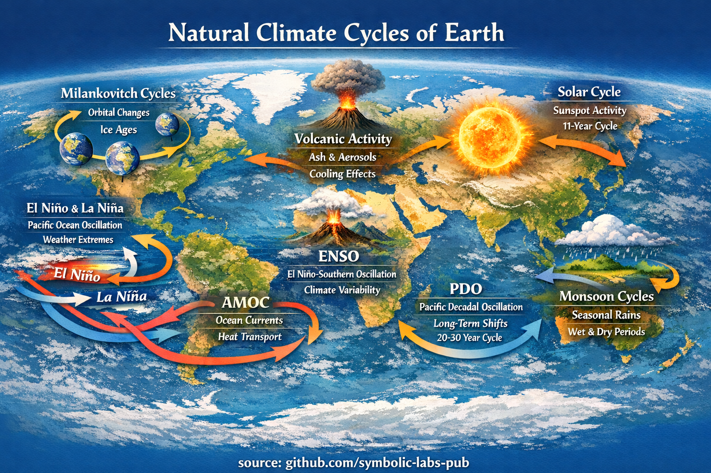

# Earth’s Climate as a Living System

## Natural Cycles, Scales, and the Architecture of Stability

Earth’s climate is not a static background condition but a dynamic, self-regulating system shaped by interacting natural cycles operating across vastly different time scales. This essay synthesizes the principal natural climate lifecycles visualized in the accompanying infographic, framing them as components of a coupled planetary system. By understanding these cycles—orbital, solar, oceanic, atmospheric, geological, and biospheric—we gain insight into how climate stability emerges, how variability is generated, and why disturbances can propagate globally.

---

## 1. Climate as a System, Not a Snapshot

Climate is often misunderstood as a long-term average of weather. Scientifically, it is better described as a **nonlinear, coupled dynamical system** governed by energy flows, material cycles, and feedback loops.

Key properties of the climate system:

* **Multi-scale**: Processes range from years to hundreds of thousands of years.
* **Coupled**: Atmosphere, oceans, ice, land, and biosphere are inseparable.
* **Regulated**: Stability emerges from feedbacks, not from equilibrium.
* **Sensitive**: Small forcings can be amplified through internal dynamics.

The infographic presents Earth’s climate as a map of interacting cycles rather than isolated mechanisms—this is the correct mental model.

---

## 2. Orbital Forcing: The Long Memory of Climate

### Milankovitch Cycles (10⁴–10⁵ years)

Earth’s orbital geometry changes predictably over geological time:

* **Eccentricity** (~100,000 years): Shape of Earth’s orbit
* **Obliquity** (~41,000 years): Tilt of Earth’s axis
* **Precession** (~23,000 years): Wobble of the axis

These cycles redistribute solar energy across latitudes and seasons, pacing ice ages and interglacial periods.

**Key insight**:
Orbital changes do not directly cause warming or cooling—they *modulate* how solar energy is seasonally and geographically delivered, which then triggers ice–albedo and carbon-cycle feedbacks.

---

## 3. Solar Variability: The External Pulse

### Solar Cycle (~11 years)

The Sun’s energy output fluctuates slightly due to magnetic activity (sunspots).

* Variations are small (~0.1% in total solar irradiance)
* Effects are subtle but detectable in upper-atmospheric chemistry and circulation patterns

**Important distinction**:
Solar cycles influence *variability*, not long-term climate trends on their own.

---

## 4. Ocean–Atmosphere Oscillations: The Climate’s Nervous System

Oceans store ~90% of the excess heat in the climate system. Their circulation patterns act as delayed feedback mechanisms.

### ENSO (El Niño–Southern Oscillation) | 2–7 years

* Redistributes heat across the Pacific
* Alters rainfall, droughts, floods, and storm tracks globally

### PDO (Pacific Decadal Oscillation) | 20–30 years

* Long-lived shifts in Pacific temperature patterns
* Modulates ENSO impacts and regional climate regimes

### AMOC (Atlantic Meridional Overturning Circulation) | decades–centuries

* Transports heat from tropics to the North Atlantic
* Strongly influences European climate and Arctic ice stability

**Systems view**:
These oscillations do not “add” or “remove” energy—they **rearrange** it, producing regional extremes from global conservation.

---

## 5. Seasonal and Monsoon Cycles: Planetary Breathing

Monsoons emerge from differential heating between land and ocean.

* Driven by seasonal solar geometry
* Transport heat, moisture, and nutrients
* Support billions of people and major ecosystems

Monsoon systems illustrate a fundamental climate principle:
**Regular instability enables biological abundance.**

---

## 6. Volcanism: Abrupt Perturbations

Large volcanic eruptions inject sulfur aerosols into the stratosphere.

* Reflect incoming sunlight
* Cause short-term global cooling (1–5 years)
* Can temporarily mask or amplify other climate signals

Volcanism acts as a **natural experiment**, revealing climate sensitivity and response times.

---

## 7. The Carbon–Oxygen–Water Triad

Underlying all visible cycles are three foundational material loops:

### Carbon Cycle

* Atmosphere ↔ biosphere ↔ oceans ↔ lithosphere
* Controls long-term temperature via greenhouse forcing

### Oxygen Cycle

* Maintained by photosynthesis
* Closely coupled to carbon burial and life complexity

### Water Cycle

* Governs heat transport via evaporation and condensation
* Links atmosphere, oceans, ice, and land

These cycles are slow to change but powerful in effect, providing the **structural memory** of Earth’s climate.

---

## 8. Stability Through Regulation, Not Maximization

A central lesson of the climate system is counterintuitive:

> **Stability does not arise from maximizing efficiency or uniformity, but from regulated imbalance.**

* Temperature gradients drive circulation
* Seasonal contrasts sustain ecosystems
* Variability enables resilience

When regulation is disrupted faster than feedbacks can respond, the system shifts into new regimes.

---

## 9. Reading the Map as a System Diagram

The infographic should not be read left-to-right or top-to-bottom. It is a **system map**:

* Arrows indicate flows, not causes
* Cycles overlap in space but differ in time scale
* No single component “controls” climate

This framing is essential for avoiding simplistic interpretations.

---

## 10. Conclusion: A Planet That Remembers

Earth’s climate is best understood as a living system with memory, inertia, and adaptive capacity. The natural lifecycles visualized in the infographic represent the deep architecture that has allowed Earth to remain habitable for millions of years.

Understanding these cycles is not about nostalgia for a past climate—it is about recognizing:

* Which processes are slow
* Which are fast
* Which are fragile
* And which are foundational

Only by respecting the system as a whole can meaningful interpretation—or intervention—be responsibly discussed.

---

**source:** [github.com/symbolic-labs-pub](https://github.com/symbolic-labs-pub) at early 2026
