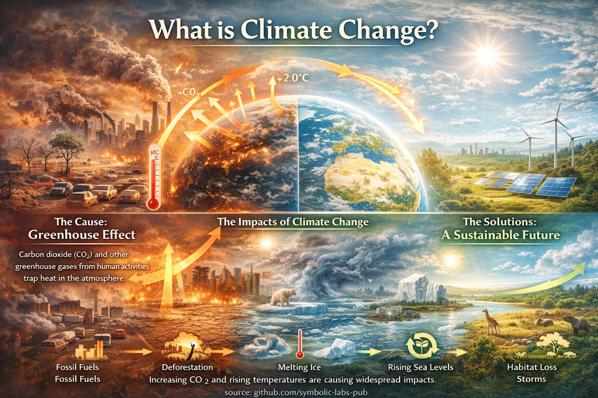

# What Is Climate Change?

## From Natural Variability to Human-Driven Forcing

Climate change refers to a persistent alteration in the statistical properties of Earth’s climate system—most notably global temperature, precipitation patterns, and the frequency of extreme events—over multi-decadal to centennial timescales. While Earth’s climate has always changed due to natural cycles, modern climate change is distinguished by its speed, global coherence, and dominant anthropogenic drivers. This essay explains climate change as a physical process rooted in energy balance, feedback mechanisms, and system inertia, contextualizing the mechanisms, impacts, and future pathways visualized in the accompanying infographic.

---

## 1. Climate vs. Weather: A Systems Definition

**Weather** describes short-term atmospheric conditions.
**Climate** describes the long-term behavior of the Earth system.

Formally, climate is the **statistical distribution of weather variables**—temperature, precipitation, winds—over periods typically exceeding 30 years. Climate change occurs when this distribution itself shifts.

Key point:

> Climate change is not defined by isolated hot years or storms, but by **persistent changes in baseline conditions**.

---

## 2. Earth’s Energy Balance: The Physical Core

At its foundation, climate change is a **radiative imbalance problem**.

Earth’s temperature is governed by:

* Incoming solar radiation
* Reflection (albedo) by clouds, ice, and land
* Outgoing infrared radiation emitted to space

Greenhouse gases—primarily carbon dioxide (CO₂), methane (CH₄), and nitrous oxide (N₂O)—absorb and re-emit infrared radiation, **slowing heat loss** from the planet.

This process, the **greenhouse effect**, is natural and essential. Without it, Earth would be frozen.

Climate change arises when this balance is **systematically altered**.

---

## 3. What Is New About Modern Climate Change?

Earth’s climate has changed before. What is unprecedented is the **rate and source** of current change.

### Key distinctions:

* **Speed**: Global average temperature has increased by ~1.2 °C since the late 19th century—far faster than most natural transitions.
* **Global coherence**: Warming occurs simultaneously across land, oceans, and the atmosphere.
* **Forcing origin**: The dominant driver is human activity, not orbital or solar variation.

The infographic’s arrows illustrate this central idea: **added greenhouse gases reduce outgoing heat**, shifting the entire climate baseline upward.

---

## 4. Anthropogenic Drivers

### Fossil Fuel Combustion

* Releases carbon stored over hundreds of millions of years
* CO₂ concentration has risen from ~280 ppm (pre-industrial) to over 420 ppm

### Land-Use Change and Deforestation

* Reduces carbon sinks
* Alters surface reflectivity and water cycling

### Industrial and Agricultural Processes

* Methane from livestock and rice cultivation
* Nitrous oxide from fertilizers

These drivers act as **external forcings**, pushing the climate system away from its previous operating range.

---

## 5. Amplification Through Feedbacks

Climate change is not linear. It is governed by feedback loops.

### Major positive feedbacks:

* **Ice–albedo feedback**: Melting ice exposes darker surfaces, increasing heat absorption
* **Water vapor feedback**: Warmer air holds more moisture, amplifying greenhouse warming
* **Carbon feedbacks**: Warming soils and oceans release additional greenhouse gases

These feedbacks explain why relatively small initial forcings can lead to **large systemic responses**.

---

## 6. Observed Impacts: Signals Across the System

The impacts shown in the infographic are not projections—they are already observed.

### Physical impacts

* Rising global mean temperature
* Accelerated glacier and ice-sheet loss
* Sea-level rise from thermal expansion and melting ice

### Ecological impacts

* Shifts in species ranges
* Coral bleaching
* Altered growing seasons

### Societal impacts

* Increased heat extremes
* Intensified droughts and floods
* Higher risks to food, water, and infrastructure systems

Crucially, these impacts **interact**, producing compound risks.

---

## 7. Climate Change as a Risk Multiplier

Climate change rarely acts alone. Instead, it **amplifies existing vulnerabilities**:

* Poverty
* Political instability
* Ecosystem degradation
* Infrastructure fragility

This framing is essential: climate change is not just an environmental issue, but a **systems stressor** affecting interconnected human and natural networks.

---

## 8. Futures Are Not Fixed: Path Dependence

The right side of the infographic emphasizes an often-missed scientific reality:

> Climate outcomes depend on **cumulative decisions**, not fate.

Because CO₂ persists in the atmosphere for centuries:

* Every avoided emission matters
* Early action has disproportionate impact
* Delays lock in higher long-term risks

Climate trajectories are **path-dependent**, meaning present choices shape the feasible future states of the system.

---

## 9. A Bright Future Is Physically Possible

From a scientific standpoint, a stabilized climate is achievable if:

* Net greenhouse gas emissions approach zero
* Natural and engineered sinks are protected and enhanced
* Energy, land, and material systems are redesigned coherently

This is not optimism—it is a statement about **system controllability** under known physical laws.

---

## 10. Conclusion: Climate Change as a Design Challenge

Climate change is best understood not as an abstract threat, but as a **design constraint** on civilization.

It reflects:

* How energy is produced
* How land is used
* How feedbacks are managed
* How long-term stability is valued over short-term extraction

The infographic presents climate change not as an endpoint, but as a **decision space**—one where physics sets the rules, but human systems determine the outcome.

---

**source:** [github.com/symbolic-labs-pub](https://github.com/symbolic-labs-pub)
