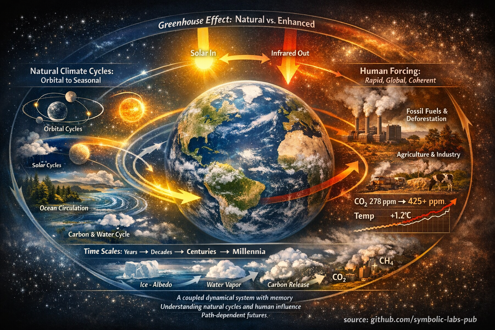

# Understanding Climate: Systems, Cycles, and Change

Climate science provides the physical foundation for understanding why human activities affect Earth's temperature, weather patterns, and ecosystems—and why those effects persist across generations. This section examines climate as a coupled dynamical system governed by energy flows, material cycles, and feedback mechanisms operating across timescales from years to hundreds of thousands of years.

---

## The Foundation of Climate Science

Climate is not a static backdrop to human civilization, but an active, self-regulating system shaped by interactions between the atmosphere, oceans, ice, land surface, and biosphere. Understanding climate requires distinguishing between natural variability—driven by orbital geometry, solar activity, and ocean circulation—and anthropogenic forcing driven by greenhouse gas emissions.

This section explores climate through two complementary lenses:

---

### [Natural Climate Cycles](01_cycles/README.md)

Earth's climate operates through interlocking natural cycles across vastly different timescales. This essay examines the orbital forcing that paces ice ages, the solar variability that modulates atmospheric chemistry, the ocean-atmosphere oscillations that redistribute heat globally, and the biospheric feedbacks that regulate carbon and water. Understanding these cycles reveals how climate stability emerges from dynamic processes—and why disturbances can propagate globally.

**Key concepts:**
- Milankovitch cycles and ice age pacing
- ENSO, PDO, and AMOC: the climate's circulation patterns
- Carbon and water cycles as planetary regulators
- Volcanic eruptions as natural perturbations

---

### [What Is Climate Change?](02_what_is/README.md)

Climate change refers to persistent alterations in Earth's energy balance caused primarily by human activities—fossil fuel combustion, deforestation, and industrial agriculture. This essay explains climate change as a physical process rooted in radiative forcing, feedback amplification, and system inertia. It distinguishes modern anthropogenic change from natural variability by its speed, global coherence, and dominant forcing mechanism.

**Key concepts:**
- Earth's energy balance and the greenhouse effect
- Anthropogenic drivers: CO₂, methane, land-use change
- Positive feedbacks: ice-albedo, water vapor, carbon release
- Observed impacts across physical, ecological, and social systems
- Path dependence: why early action matters

---

## Why This Matters

Climate science is not an abstract discipline—it describes the physical constraints within which all human societies operate. Temperature, precipitation, sea level, and ecosystem stability are not negotiable; they respond to energy flows and material cycles governed by physics, chemistry, and biology.

Understanding these systems enables:

1. **Informed decision-making**: Distinguishing effective climate action from symbolic gestures
2. **Risk assessment**: Recognizing which impacts are reversible and which are not
3. **System design**: Aligning energy, food, and material systems with planetary boundaries
4. **Realistic expectations**: Understanding timescales of both damage and recovery

---

## Current Context (early 2026)

| Metric | Value | Context |
|--------|-------|---------|
| Atmospheric CO₂ | 425.7 ppm | 52% above pre-industrial (278 ppm) |
| Global temperature anomaly | ~1.2°C | Relative to late 19th century |
| Annual emissions | 38.1 GtCO₂ | From fossil fuels alone |
| Remaining 1.5°C budget | ~170 GtCO₂ | Approximately 4 years at current rates |
| Ocean heat content | Record high | 90% of excess heat stored in oceans |

These numbers are not predictions—they are measurements of a system already in transition.

---

## Navigating This Section

- **Start with natural cycles** to understand the baseline climate system: [Climate Cycles](01_cycles/README.md)
- **Then examine anthropogenic change** to see how human activities alter that system: [What Is Climate Change?](02_what_is/README.md)
- **Apply this knowledge** to the action-oriented sections: [At Home](../01_At_Home/README.md), [Travel](../02_Travel/README.md), [Energy Sources](../03_Energy_Sources/README.md)

---

## Conclusion

Climate is not a problem to be solved through technology alone, nor through policy alone, nor through individual virtue alone. It is a **systems challenge** requiring coordination across physical understanding, institutional design, and collective action.

The essays in this section provide the scientific foundation for recognizing which interventions align with physical reality—and which do not. Climate outcomes are not predetermined; they depend on cumulative decisions made across energy systems, land use, and material flows.

Understanding climate science is the first step toward designing a civilization that operates within, rather than against, the planetary system that sustains it.

---

| | |
|:--|--:|
| [< previous \| Home](../README.md) | [Climate Cycles \| next >](01_cycles/README.md) |

---

**source:** [github.com/symbolic-labs-pub](https://github.com/symbolic-labs-pub) at early 2026
