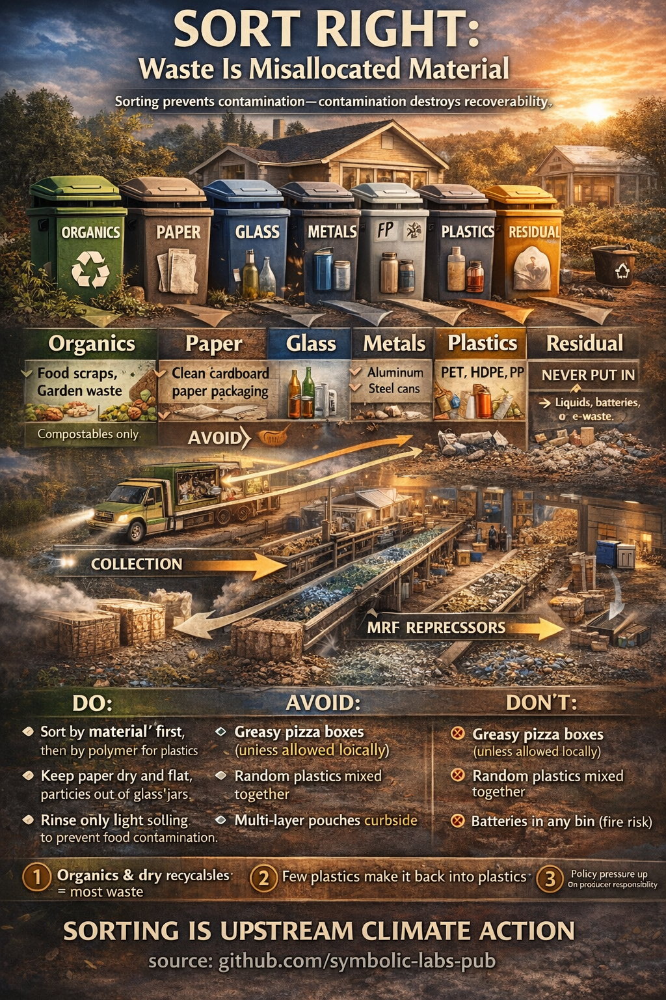

# Selective Waste Sorting as Upstream Climate Action

Selective waste sorting is commonly presented as a civic duty or environmental gesture. In reality, it is a **materials-management intervention** that operates at the very beginning of industrial value chains. Its climate relevance arises not from symbolism, but from physics: contamination collapses material recoverability, increases energy demand, and forces substitution with virgin, fossil-intensive inputs. This essay explains why selective waste sorting matters, how modern recycling systems function, where their limits lie, and how individual behavior directly influences whether materials re-enter productive cycles or become permanent waste.

---

## 1. Waste Is a Classification Problem, Not a Disposal Problem

From a scientific perspective, “waste” does not exist as a material category. There are only **materials placed in the wrong context**.

Municipal solid waste is a heterogeneous mixture of organic matter, polymers, metals, minerals, fibers, and hazardous compounds. Recycling systems depend on **separation by material class**, because each class obeys different chemical, thermal, and mechanical constraints. When incompatible materials are mixed, the resulting stream becomes economically and physically unrecoverable.

Thus, selective waste sorting is best understood as **pre-processing**—the first and often most decisive step in an industrial recovery pipeline.

---

## 2. The Core Principle: Contamination Destroys Recoverability

All recycling systems share a common vulnerability: **contamination**.

* Food residues ruin [paper](#32-paper-and-cardboard-managed-fiber-circulation) fibers.
* Ceramics ruin [glass](#33-glass-a-true-closed-material-loop) melts.
* Mixed polymers ruin [plastic](#35-plastics-polymer-physics-and-the-limits-of-recycling) extrusion.
* Batteries introduce fire risk and toxic metals.
* Hazardous chemicals poison entire batches.

Once contamination exceeds a relatively low threshold, downstream processors must either:

1. Increase energy- and water-intensive cleaning, or
2. Reject the batch entirely.

In both cases, climate impact increases. Either more fossil energy is used to compensate, or virgin materials are substituted.

Selective sorting is therefore not about increasing recycling *rates*, but about preserving **material quality**.

---

## 3. Material Categories and Their Industrial Cycles

### 3.1 Organic Waste: The Biological Loop

Organic waste—food scraps, garden waste, compostable fibers—belongs to the **biological carbon cycle**.

When landfilled, organic matter decomposes anaerobically, producing methane, a greenhouse gas far more potent than carbon dioxide over short time horizons. When separately collected, it can be composted or anaerobically digested, producing soil amendments and biogas.

From a systems perspective, organic sorting:

* Prevents methane formation
* Restores soil carbon
* Substitutes fossil-derived fertilizers and fuels

This is a closed-loop system only if contamination (plastics, metals) is kept minimal.

---

### 3.2 Paper and Cardboard: Managed Fiber Circulation

Paper is composed of cellulose fibers that shorten with each recycling cycle. Clean, dry paper can be recycled multiple times before fibers degrade beyond usability, at which point they safely return to the biosphere.

The paper value chain relies heavily on **fiber purity**. Food oils, moisture, and plastic coatings interfere with pulping and de-inking processes. A single greasy fraction can downgrade an entire bale.

Paper recycling is therefore not limited by technology, but by **sorting discipline** at the source.

---

### 3.3 Glass: A True Closed Material Loop

Container glass (bottles and jars) is one of the most robust recycling materials available. When correctly sorted, it can be recycled indefinitely without loss of quality.

However, glass recycling is chemically sensitive. Ceramics, window glass, and heat-resistant glass have different melting points and compositions. Even small quantities can cause structural defects in new containers.

Here, selective sorting functions as **chemical quality control**.

---

### 3.4 Metals: The Highest Energy Leverage

Metals—especially aluminum and steel—offer the greatest climate return per correctly sorted item.

Producing aluminum from recycled scrap requires only a fraction of the energy needed for primary production from bauxite. Steel recycling similarly avoids the most carbon-intensive steps of iron ore reduction.

Metal recycling systems are technologically mature, but depend on separation mechanisms (magnets, eddy currents) that function best when metals are not embedded in composite waste or contaminated with residues.

---

### 3.5 Plastics: Polymer Physics and the Limits of Recycling

Plastics are the most misunderstood waste category.

“Plastic” is not a material, but a **family of polymers** with incompatible melting points, mechanical properties, and additive packages. Mechanical recycling—the dominant method globally—requires relatively pure polymer streams (e.g., PET with PET, HDPE with HDPE).

When polymers are mixed:

* Melts become unstable
* Mechanical strength collapses
* Products are downcycled or rejected

Chemical recycling technologies exist, but remain energy-intensive and limited in scale. As a result, global plastic recycling rates remain low, and much plastic is landfilled, incinerated, or mismanaged.

From a climate and risk perspective, plastic sorting is necessary but insufficient; **[plastic avoidance](../04_prefer_natural_materials/)** remains the most effective strategy.

---

### 3.6 Special and Hazardous Waste: Outside the Municipal Loop

Certain materials do not belong in any standard recycling stream:

* Batteries
* Electronics
* Paints and solvents
* Medical waste
* Composite laminates

These require specialized handling because they pose fire, toxicity, or contamination risks. Improper disposal can shut down entire facilities or cause catastrophic incidents.

Correct sorting here is not about recycling efficiency, but **system safety**.

---

## 4. The Industrial Recycling Value Chain

Once sorted at the household level, materials pass through a multi-stage industrial system:

1. **Collection and transport**
2. **Materials Recovery Facilities (MRFs)** using mechanical, magnetic, optical, and manual sorting
3. **Reprocessors** that clean, shred, melt, pulp, or pelletize materials
4. **Manufacturers** that substitute recycled feedstock for virgin inputs

Each stage amplifies the effects of upstream sorting. Errors made at the household level propagate forward, increasing losses, costs, and emissions.

This makes selective waste sorting an example of **upstream climate action**: small interventions early in the chain prevent large impacts later.

---

## 5. Global Trends and Structural Limits

Globally, waste generation is increasing faster than recycling capacity. Policy frameworks increasingly focus on extended producer responsibility, recycled content mandates, and packaging redesign. However, no policy can compensate for fundamentally contaminated input streams.

Recycling systems are constrained not only by technology, but by **thermodynamics, material chemistry, and economics**. Selective sorting aligns human behavior with these constraints rather than working against them.

---

## 6. Conclusion

Selective waste sorting is not about being environmentally virtuous. It is about respecting material boundaries and preserving industrial optionality.

By sorting waste correctly, individuals:

* Reduce methane emissions
* Lower industrial energy demand
* Preserve material quality
* Prevent irreversible pollution
* Enable circular value chains to function at all

In climate terms, selective waste sorting is not downstream cleanup—it is **upstream prevention**. It is one of the rare individual actions whose impact scales cleanly through complex industrial systems.

The physics is clear. The chemistry is clear. The system already exists.

The only remaining variable is whether materials enter it in the right form.

---

**source:** github.com/symbolic-labs-pub
