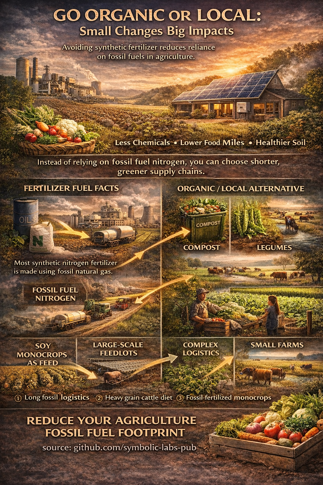

# Food, Fossil Nitrogen, and Climate: Why Organic and Local Consumption Matters

Modern food systems are deeply entangled with fossil energy, not primarily through transport, but through fertilizer chemistry. The widespread use of synthetic nitrogen fertilizer—produced almost exclusively from fossil natural gas—has enabled high-yield industrial agriculture while simultaneously becoming a major driver of greenhouse gas emissions, ecosystem disruption, and supply-chain fragility. This essay explains why consuming home-grown or organic food can reduce climate impact, how fertilizer production underpins industrial food systems, and why organic agriculture functions today as a “least-bad” alternative rather than a perfect solution.

---

## 1. The Hidden Fossil Core of Modern Food

At first glance, food appears biological. In reality, much of modern agriculture is **petrochemical**.

The cornerstone is synthetic nitrogen fertilizer, produced via the **Haber–Bosch process**, which converts atmospheric nitrogen (N₂) into ammonia (NH₃). While nitrogen itself is abundant and free, the process requires:

* High temperatures
* High pressures
* Hydrogen, almost always derived from fossil natural gas

Globally, nitrogen fertilizer production consumes a significant share of industrial [natural gas](../../03_Energy_Sources/03_fossil/README.md) and accounts for a substantial portion of agricultural greenhouse gas emissions. This makes food production not only energy-intensive, but **fossil-dependent at a chemical level**.

---

## 2. Why Nitrogen Matters More Than Transport

Public discussions often focus on “food miles.” While transport matters, it is rarely the dominant emission source for plant-based foods.

Nitrogen fertilizer affects emissions in three compounding ways:

1. **Upstream emissions** from natural gas extraction and ammonia synthesis
2. **On-field emissions** of nitrous oxide (N₂O), a greenhouse gas far more potent than CO₂
3. **Downstream ecological damage**, including water pollution and soil degradation

As long as nitrogen fertilizer is fossil-derived, large-scale monoculture farming remains structurally tied to fossil energy, regardless of how efficient tractors or logistics become.

---

## 3. Industrial Agriculture as a System

Industrial agriculture is optimized for scale, uniformity, and predictability. Its typical structure looks like this:

* [Fossil fuels](../../03_Energy_Sources/03_fossil/README.md) → fertilizer production
* Fertilizer → monoculture crop systems
* Crops → long-distance [logistics](../../02_Travel/01_transport/README.md)
* Processing → packaging → global distribution

This system excels at producing large quantities of inexpensive calories. However, it is brittle. It depends on stable fossil energy prices, global logistics, and externalized environmental costs.

Livestock systems amplify these effects. Grain-fed cattle rely on fertilizer-intensive monocrops, which multiply fossil inputs and nitrogen losses before calories reach human consumption.

---

## 4. Organic Agriculture: What It Is—and Is Not

Organic agriculture is often misunderstood as “natural” or “impact-free.” Scientifically, it is neither.

Organic systems:

* Avoid synthetic nitrogen fertilizer
* Rely on [compost](../01_why_selective_trash/#31-organic-waste-the-biological-loop), manure, crop rotation, and nitrogen-fixing plants (e.g. legumes)
* Use biological nutrient cycles rather than industrial ones

This reduces fossil inputs substantially, but introduces trade-offs:

* Lower average yields per hectare
* Higher labor and land requirements
* Higher consumer prices

Organic food is therefore not a universal solution. It is a **partial decoupling strategy**—one that reduces dependence on fossil nitrogen while maintaining food production.

---

## 5. Home-Grown Food: Small Scale, High Leverage

Growing food at home or in community gardens does not scale to feed cities. Its importance lies elsewhere.

Home-grown food:

* Eliminates synthetic fertilizer use entirely
* Collapses transport and packaging
* Returns organic waste directly to soil
* Rebuilds nutrient literacy at the household level

From a systems perspective, home food production functions as **education, buffering, and resilience**, not as a primary calorie source.

---

## 6. Supply Chains and Complexity

Modern food supply chains are among the most complex systems humans have built. Each additional step—fertilizer production, transport, processing, cold storage—adds energy use, emissions, and vulnerability.

Organic and local food systems shorten these chains:

* Fewer intermediaries
* Less fossil input
* Greater transparency

This does not eliminate emissions, but it reduces **systemic exposure** to fossil energy shocks and nitrogen-related environmental damage.

---

## 7. Why Organic Is the “Best Bad Option” Today

At present, there is no widely deployed, fossil-free replacement for synthetic nitrogen fertilizer at global scale. “Green ammonia” produced using renewable hydrogen exists, but remains limited and expensive.

Until such systems mature, societies face a choice:

* Continue optimizing fossil-dependent agriculture
* Or partially retreat from it where possible

Organic and local food consumption represents a pragmatic compromise: not ideal, but directionally correct.

---

## 8. Individual Action in a Structural Problem

An individual cannot redesign global agriculture. However, individual consumption choices influence demand signals, land use patterns, and policy priorities.

By choosing organic or local food when feasible, individuals:

* Reduce fossil nitrogen demand
* Support alternative nutrient cycles
* Encourage diversification away from monocultures
* Lower cumulative greenhouse gas emissions

These effects are incremental, but cumulative.

---

## Conclusion

Climate change in agriculture is not primarily a problem of distance or machinery. It is a problem of **chemical dependency**.

Synthetic nitrogen fertilizer—produced with fossil energy—sits at the center of modern food systems. Until a clean alternative exists, reducing reliance on fertilizer-intensive agriculture is one of the few levers available.

Consuming home-grown or organic food does not solve the problem. It **weakens its grip**.

In climate mitigation, progress often comes not from perfect solutions, but from reducing irreversible dependencies. Food is one of the clearest places where individuals can do exactly that.

---

| | |
|:--|--:|
| [< previous \| Energy Timing](../02_use_appliances_at_sunlight/README.md) | [Natural Materials \| next >](../04_prefer_natural_materials/README.md) |

---

**source:** [github.com/symbolic-labs-pub](https://github.com/symbolic-labs-pub) at early 2026
