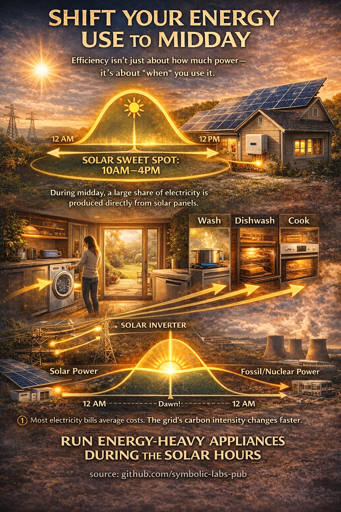
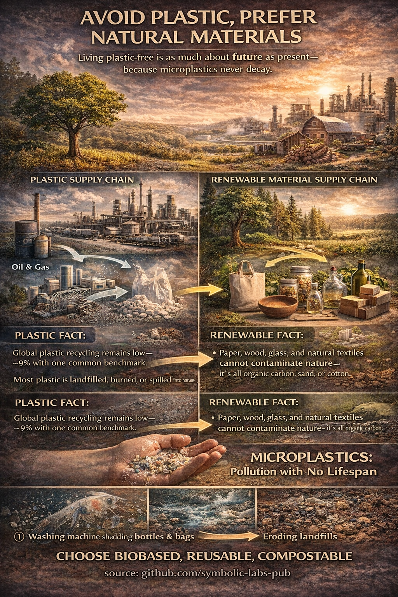
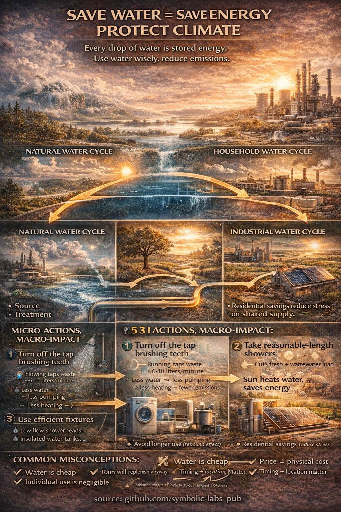

# [Reversing Climate Change Begins at the System Boundaries](https://github.com/symbolic-labs-pub/climate-change/tree/main/01_At_Home)

Climate change is often framed as a global problem requiring global solutions—and this is true. Yet the mechanisms that drive it operate at very concrete, local boundaries: inside homes, across supply chains, through material flows, and within energy systems that respond to physics rather than intentions. The infographic accompanying this essay visualizes these boundaries and shows how individual actions, when aligned with physical realities, can reduce emissions not symbolically, but structurally.

This essay explains the logic behind those actions.

---

## 1. Climate Change Is a Systems Failure, Not a Moral One

At its core, climate change arises from **misaligned cycles**:

* Materials are extracted but not returned. → [Waste sorting](01_why_selective_trash/)
* Energy is produced when it is most polluting, not when it is cleanest. → [Energy timing](02_use_appliances_at_sunlight/)
* Food is grown using fossil chemistry rather than biological cycles. → [Organic food](03_go_organic/)
* Water is treated as infinite despite being energetically expensive. → [Water conservation](05_treasure_water/)

None of these failures are caused by individual malice. They are consequences of systems optimized for short-term efficiency rather than long-term stability. Individuals cannot fix the system alone—but they can reduce the pressure placed upon it by acting where their decisions intersect directly with physical processes.

---

## [2. Waste Is Not Garbage — It Is Misplaced Matter](01_why_selective_trash)

When waste is mixed, it becomes chemically and economically unrecoverable. When separated, it re-enters either **biological cycles** (biomass) or **technical cycles** (glass, metals, paper).

Organic waste, when landfilled, produces methane—one of the most potent greenhouse gases. When composted or digested, it returns carbon to soil or produces usable biogas. Glass and metals, when properly separated, can be recycled almost indefinitely with far lower energy than virgin production. Paper fibers can be reused several times before returning safely to the biosphere.

Plastics are the exception. Even when recycled, most plastics degrade in quality and eventually fragment into [microplastics](04_prefer_natural_materials/)—particles now found in oceans, soil, air, and human bloodstreams. There is no known technological solution for removing microplastics at scale. The only effective intervention is **source reduction**.

Waste separation works not because it is virtuous, but because it preserves **material integrity**.

---

## [3. Energy Use Is Not Just About How Much — But When](02_use_appliances_at_sunlight)

 

Electricity is not equally clean at all hours. Increasingly, the cleanest electricity is produced **during the day**, when [solar](../03_Energy_Sources/08_solar/) generation peaks. Yet most households still consume energy without regard to timing, because pricing and billing systems lag behind infrastructure reality.

Running appliances—washing machines, dishwashers, cooking equipment—during daylight hours aligns consumption with low-carbon supply. Even if household bills do not yet reflect this benefit, the grid does. This reduces reliance on fossil “peaker plants,” smooths demand curves, and increases the share of renewables the system can absorb.

Climate impact is governed by **temporal alignment**, not just efficiency.

---

## [4. Food Is Energy, Chemistry, and Logistics Combined](03_go_organic)

Modern industrial agriculture depends heavily on synthetic nitrogen fertilizer, produced almost exclusively using fossil natural gas through the Haber–Bosch process. This single step accounts for a significant share of global emissions and introduces reactive nitrogen into ecosystems, disrupting water systems and soil biology.

Organic and local food systems are not impact-free. They often yield less per hectare and may cost more. However, they reduce fossil inputs, shorten supply chains, and restore biological nitrogen cycles through crop rotation and soil organisms.

Growing even a small portion of one’s own food reduces transport, packaging, and fertilizer demand simultaneously. Reducing food waste—one of the largest hidden emission sources—often has a greater impact than dietary changes alone.

Food choices matter not because of ideology, but because agriculture is one of the few sectors where **biology can replace fossil chemistry**.

---

## [5. Plastics Break the Carbon Cycle Permanently](04_prefer_natural_materials)

Wood, paper, and natural fibers participate in the carbon cycle: they grow, decay, and return carbon to the biosphere. Plastics do not. They are carbon extracted from geological time and scattered into ecological time, where it does not belong.

Recycling plastics delays, but does not prevent, this outcome. Over time, plastics fragment into microplastics that accumulate irreversibly. Unlike deforestation, which can be reversed by replanting, microplastic pollution has no known pathway back to safety.

Choosing natural materials wherever possible is not nostalgia—it is **risk containment**.

---

## [6. Water Conservation Is Energy Conservation](05_treasure_water)

Every liter of treated water carries an energy cost: extraction, purification, pumping, heating, and wastewater treatment. In many regions, water systems are among the largest electricity consumers.

Simple actions—turning off taps while brushing teeth, limiting shower duration—reduce demand across the entire water lifecycle. More advanced solutions, such as gray water reuse and [solar thermal water heating](../03_Energy_Sources/08_solar/), further decouple water use from fossil energy.

Water is renewable in theory, but **energy-limited in practice**.

---

## 7. Insulation and Electrification: The Structural Core

The most powerful climate action an individual can take is not behavioral—it is architectural.

Buildings lose energy primarily through heat. Insulation reduces demand permanently, often for decades. Heat recovery ventilation allows fresh air without discarding thermal energy. Electrifying heating through [heat pumps](../03_Energy_Sources/10_heat_pumps/) replaces combustion with systems that move heat rather than generate it, often delivering three to five units of heat per unit of electricity.

Critically, electrification only works well when paired with insulation. Producing clean energy while wasting it is not progress—it is inefficiency disguised as innovation.

The correct sequence is simple:

1. Reduce demand (insulation)
2. Preserve quality (heat recovery)
3. Decarbonize supply ([electrification](../03_Energy_Sources/10_heat_pumps/))
4. Add [renewables](../03_Energy_Sources/04_renewables/)

---

## 8. Small Actions, Large Structural Effects

None of these actions alone “solve” climate change. Their power lies in **alignment**:

* With thermodynamics
* With material science
* With biological cycles
* With grid realities

When many individuals act in ways that reduce irreversible damage and preserve systemic flexibility, societies gain time—time to decarbonize industry, scale clean infrastructure, and adapt institutions.

Climate stability is not achieved by perfection, but by coordination with reality.

---

## Conclusion

Climate change does not ask individuals to be heroes. It asks them to stop forcing systems to operate against their own physics. Sorting waste, timing energy use, choosing materials wisely, conserving water, insulating homes, and electrifying heat are not symbolic gestures. They are interventions at the boundaries where human behavior meets planetary systems.

The future depends less on what we promise, and more on how well we understand the flows we are already part of.

---

| | |
|:--|--:|
| [< previous \| Home](../) | [Selective Waste Sorting \| next >](01_why_selective_trash/) |

---

**source:** [github.com/symbolic-labs-pub](https://github.com/symbolic-labs-pub) at early 2026
