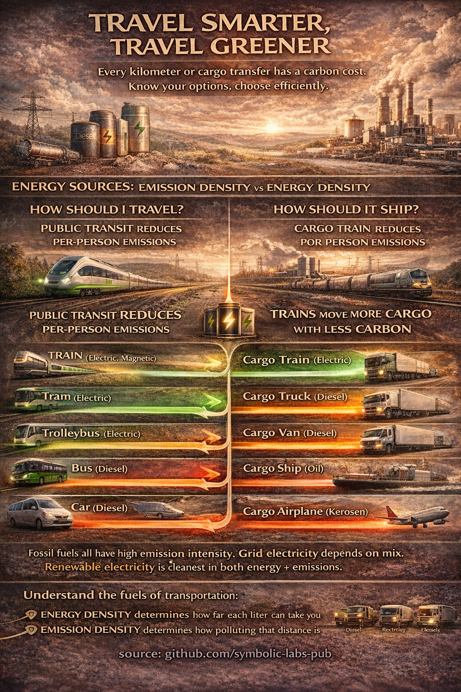

# Transportation, Energy Density, and Climate Impact

## Why How We Move Matters More Than How Fast We Move

Transportation is one of the largest and fastest-growing sources of greenhouse gas emissions globally. Its climate impact is governed less by intent or distance alone, and more by fundamental physical constraints: energy density, vehicle mass, occupancy, and infrastructure efficiency. This essay examines private and cargo transportation modes through the lens of energy and emission intensity, explains why certain modes are intrinsically more climate-efficient than others, and outlines how individual choices—especially in mode selection—can meaningfully reduce emissions without sacrificing mobility.

---

## 1. Transportation as an Energy Conversion Problem

All transportation reduces to a single physical task: **moving mass over distance**.
The climate impact of this task depends on:

* **Energy density** of the fuel (energy per unit mass or volume)
* **Efficiency** of converting that energy into motion
* **Load factor** (people or cargo moved per vehicle)
* **Infrastructure losses** (rolling resistance, drag, congestion)

Transportation emissions scale with how inefficiently energy is converted into useful movement.

---

## 2. Energy Sources and Their Physical Constraints

Different transport modes rely on fundamentally different energy carriers:

| Energy source         | Approx. energy density (MJ/kg) | Climate implication                    |
| --------------------- | ------------------------------ | -------------------------------------- |
| Electricity (battery) | ~0.5–1 (system-level)          | Low emissions if grid is clean         |
| Diesel                | ~45                            | High CO₂ per liter                     |
| Gasoline              | ~46                            | High CO₂ per liter                     |
| Kerosene (jet fuel)   | ~43                            | Extremely emission-intensive           |
| Heavy fuel oil        | ~40                            | High emissions, but efficient at scale |

High energy density enables long range and high speed—but also locks in fossil carbon emissions unless the carrier itself is decarbonized.

---

## 3. Private Transport: Per-Person Emissions Matter

### 3.1 Rail-Based Transport (Lowest Impact)

**Electric trains, trams, trolleybuses**

* Steel-on-steel rolling resistance is minimal
* High passenger capacity
* Electric drivetrains are highly efficient
* Can be powered by renewables

Per passenger-kilometer, electrified rail is among the **lowest-emission transport modes available**.

Magnetic and high-speed electric rail increase speed but retain efficiency through centralized power and high occupancy.

---

### 3.2 Buses (Moderate Impact, Highly Variable)

* Diesel buses emit less per person than cars **only when well utilized**
* Electric buses significantly reduce emissions and local pollution
* Emissions depend strongly on occupancy and route efficiency

A full bus can outperform cars by an order of magnitude; an empty bus cannot.

---

### 3.3 Private Cars (High Impact)

Cars suffer from three structural inefficiencies:

1. High vehicle mass per passenger
2. Low average occupancy
3. Stop-and-go urban driving losses

Even efficient internal combustion cars emit significantly more per person than public transport. Electric cars reduce tailpipe emissions, but still:

* Require large material inputs
* Depend on grid carbon intensity
* Occupy road space inefficiently

Cars are optimized for convenience, not climate efficiency.

---

### 3.4 Air Travel (Highest Impact)

Aviation combines:

* Extremely high energy demand
* Fossil fuels with no scalable alternative
* Emissions at high altitude, increasing climate forcing

Per passenger-kilometer, flying is among the **most carbon-intensive activities an individual can perform**. Even efficient aircraft cannot escape the physics of lift, drag, and fuel combustion.

---

## 4. Cargo Transport: Moving Goods Efficiently

Cargo transport dominates global freight emissions, but efficiency varies dramatically by mode.

### 4.1 Cargo Trains (Best Option)

* Extremely low rolling resistance
* High load capacity
* Electrification possible
* Lowest emissions per ton-kilometer on land

Rail is the backbone of low-carbon freight where infrastructure exists.

---

### 4.2 Ships (Efficient but Dirty Fuel)

* Ships move massive loads efficiently
* However, often burn heavy fuel oil
* Large absolute emissions despite good per-ton efficiency

Shipping is energy-efficient but chemically polluting; decarbonization remains difficult.

---

### 4.3 Trucks and Vans (Flexible but Costly)

* High emissions per ton-kilometer
* Essential for last-mile delivery
* Electrification helps but is limited by battery mass and range

Road freight trades efficiency for flexibility.

---

### 4.4 Cargo Aviation (Worst Case)

* Orders of magnitude higher emissions
* Used for time-critical or high-value goods
* Climate cost is extreme

Air cargo represents a **speed-for-carbon trade-off** at its most severe.

---

## 5. Why Electrification Changes the Equation

Electric drivetrains are inherently more efficient than combustion engines:

* Fewer energy conversion steps
* Less waste heat
* Regenerative braking

However, electrification alone does not guarantee low emissions. The climate benefit depends on:

* Electricity generation mix
* Vehicle size and weight
* Utilization rate

Electric public transport compounds advantages: efficient drivetrains *and* high occupancy.

---

## 6. Individual Choices with System-Level Effects

An individual cannot redesign global transport infrastructure. But individuals **choose modes**.

Climate-effective choices include:

* Replacing short flights with rail
* Prioritizing tram, trolleybus, or metro for urban travel
* Using buses instead of cars when occupancy is high
* Reducing car dependence, not just switching car types
* Favoring rail-based shipping and slower delivery options

These choices signal demand patterns that shape infrastructure investment and policy priorities.

---

## 7. Speed, Convenience, and Climate Trade-Offs

Modern transport systems are optimized for:

* Speed
* Individual convenience
* Just-in-time logistics

Climate stability favors:

* Shared systems
* High load factors
* Lower peak speeds
* Predictable flows

The tension between these objectives is not moral—it is physical. Faster, lighter, individualized transport costs more energy.

---

## Conclusion

Transportation emissions are governed by energy density, physics, and scale—not by good intentions. Public, electrified, and shared transport systems outperform private, fossil-fueled modes because they move more people and goods with less energy per unit of work.

For individuals, the most effective climate action in travel is not abstinence, but **mode choice**. Choosing trains over planes, trams over cars, and rail over trucks aligns everyday mobility with the realities of energy and climate physics.

In climate terms, how we travel matters more than how far we travel.

---

**source:** github.com/symbolic-labs-pub
