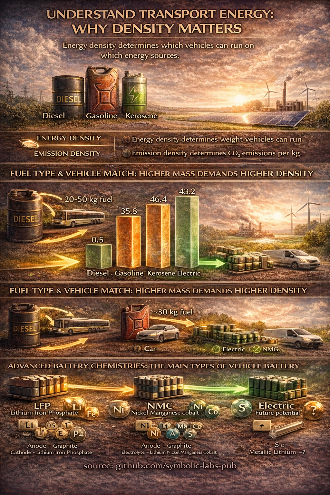

# Transportation Energy, Density, and the Path to a Brighter Low-Carbon Future

Transportation is often discussed in moral or political terms, yet its climate impact is governed by a small set of physical parameters: energy density, conversion efficiency, and system integration. This essay explains why different transport modes rely on different energy carriers, how energy density constrains what vehicles can realistically do, and why electrification—despite lower gravimetric energy density—represents a fundamentally cleaner and increasingly viable pathway. It further examines the main battery technologies used in transport today, their chemical principles, and their role in a transition toward a brighter, renewable-powered mobility system.

---

## 1. Transportation as an Energy-Density Problem

Every vehicle must store enough energy on board to overcome:

* Rolling resistance
* Aerodynamic drag
* Gravitational forces
* Inertial acceleration

The amount of energy required scales with **vehicle mass, speed, and distance**. The form in which this energy is stored—liquid fuel or electrochemical battery—determines vehicle design, range, and emissions.

Energy density, usually expressed as energy per unit mass (MJ/kg or Wh/kg), is therefore a central constraint.

---

## 2. Fossil Fuels: High Density, High Emissions

Liquid fossil fuels dominate transportation historically because of their **exceptionally high energy density**:

| Fuel                | Approx. energy density (MJ/kg) |
| ------------------- | ------------------------------ |
| Gasoline (petrol)   | ~46                            |
| Diesel              | ~45                            |
| Kerosene (jet fuel) | ~43                            |

These fuels are energy-rich, easy to transport, and fast to refuel. This makes them well-suited for:

* Long-distance trucking
* Heavy-duty vehicles
* Aviation

However, their carbon content is inseparable from their energy content. Every kilogram burned produces a predictable amount of CO₂. High energy density therefore comes with **high emission density**.

---

## 3. Electricity: Lower Density, Higher Efficiency

Electric energy stored in batteries has much lower gravimetric energy density than fossil fuels. Modern lithium-ion batteries typically store:

* ~150–300 Wh/kg (≈0.5–1 MJ/kg at system level)

At first glance, this appears limiting. Yet electric systems compensate in three decisive ways:

1. **Much higher drivetrain efficiency**
   Electric motors convert 85–95% of stored energy into motion, compared to 20–35% for internal combustion engines.

2. **Regenerative braking**
   Energy lost during braking can be partially recovered.

3. **Grid decoupling from fuel chemistry**
   Electricity can be produced from solar, wind, hydro, or nuclear sources.

As a result, electric vehicles often require **less total stored energy** to perform the same transport task, especially in urban and regional contexts.

---

## 4. Matching Energy Carriers to Vehicles

Energy density explains why different vehicles favor different energy sources:

* **Cars and buses**
  Electric drivetrains are well-suited due to moderate mass and predictable routes.

* **Urban buses and trams**
  Electrification excels because infrastructure and high utilization compensate for battery weight.

* **Heavy trucks**
  Still challenging for batteries alone, but hybrid, overhead-electric, and battery-swapping concepts are emerging.

* **Aviation**
  Extremely sensitive to weight; current battery energy density is insufficient for long-haul flight, making kerosene dominant for now.

This is not a failure of electrification, but a reflection of physics. Transition pathways differ by sector.

---

## 5. Battery Technologies: How Electric Energy Is Stored

Modern electric vehicles rely primarily on lithium-based batteries, which store energy through reversible electrochemical reactions.

### 5.1 Lithium Iron Phosphate (LFP)

* **Main elements:** Lithium (Li), Iron (Fe), Phosphorus (P), Oxygen (O)
* **Advantages:**

  * Long cycle life
  * High thermal stability
  * No cobalt or nickel
* **Trade-off:**

  * Lower energy density

LFP is increasingly favored for buses, entry-level cars, and grid-integrated transport.

---

### 5.2 Nickel Manganese Cobalt (NMC)

* **Main elements:** Lithium (Li), Nickel (Ni), Manganese (Mn), Cobalt (Co)
* **Advantages:**

  * Higher energy density
  * Longer range for passenger vehicles
* **Trade-off:**

  * Material complexity
  * Ethical and supply-chain concerns around cobalt

NMC dominates long-range passenger vehicles today.

---

### 5.3 Emerging and Future Chemistries

Research continues into:

* Solid-state lithium batteries
* Sodium-ion batteries
* Lithium-sulfur systems

These aim to improve safety, sustainability, and energy density while reducing reliance on scarce materials.

---

## 6. Why Renewables Change the Equation

The climate impact of electricity depends on how it is generated. As grids shift toward:

* Solar
* Wind
* Hydro
* Nuclear

the emissions associated with electric transport **decline automatically**, without redesigning vehicles.

This is a key asymmetry between electric and fossil systems:

* Fossil fuels are permanently carbon-bound
* Electricity becomes cleaner over time

Thus, electrification is not merely a technology choice—it is a **future-proofing strategy**.

---

## 7. A Brighter Systems Perspective

Transportation transitions do not require abandoning mobility. They require:

* Matching energy carriers to tasks
* Using high-density fuels only where unavoidable
* Electrifying everything else
* Powering electricity with renewables

Seen this way, the future of transport is not apocalyptic, but **structurally optimistic**: cleaner air, quieter cities, and energy systems aligned with natural flows rather than geological extraction.

---

## Conclusion

Energy density explains why transportation looks the way it does today—but it does not dictate the future. While fossil fuels offer unmatched energy density, they also lock in emissions. Electric systems, though lower in raw density, achieve superior efficiency and can draw from renewable sources that grow cleaner over time.

Understanding these physical realities allows individuals to make informed choices, support realistic transitions, and recognize that climate action in transport is not about sacrifice, but about **better alignment between energy, technology, and the planet**.

---

| | |
|:--|--:|
| [< previous \| Transport Modes](../01_transport/) | [Engines \| next >](../03_engines/) |

---

**source:** [github.com/symbolic-labs-pub](https://github.com/symbolic-labs-pub) at early 2026
