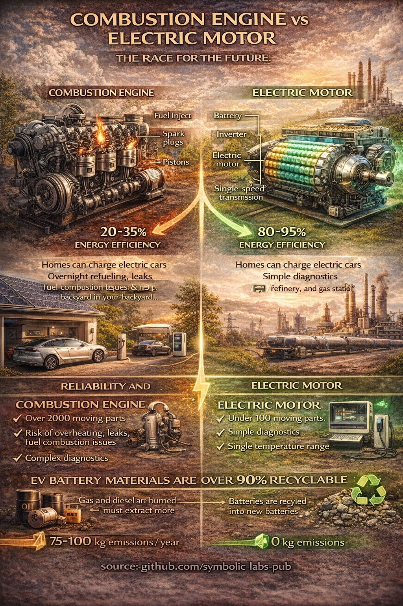

# Combustion Engines and Electric Motors: A Systems Comparison for a Low-Carbon Future

The transition from internal combustion engines to electric motors represents one of the most consequential technological shifts in transportation history. While often framed in political or emotional terms, the difference between these systems is fundamentally mechanical, thermodynamic, and systemic. This essay examines combustion engines and electric motors through exploded-system comparison: acceleration behavior, energy conversion efficiency, refueling versus charging, reliability and failure modes, long-term material impacts, and recyclability. It argues that electric propulsion aligns more naturally with climate goals not because it is flawless, but because it is simpler, more efficient, and increasingly circular.

---

## 1. Two Machines, Two Philosophies

At a mechanical level, the internal combustion engine (ICE) and the electric motor represent opposite design philosophies.

A combustion engine converts chemical energy into motion through:

* Fuel injection
* Compression
* Ignition
* Explosion
* Mechanical translation via pistons, crankshafts, valves, and gears

An electric motor converts electrical energy into motion through:

* Electromagnetic interaction
* Rotational torque generated directly on the shaft

The combustion engine is a **heat engine**.
The electric motor is a **field machine**.

This distinction explains nearly all downstream differences.

---

## 2. Why Electric Vehicles Accelerate Faster

Electric motors deliver **maximum torque at zero revolutions per minute**. This means full pulling force is available instantly, without waiting for fuel combustion cycles, air intake, or gear changes.

Combustion engines:

* Require multiple revolutions to reach peak torque
* Depend on complex transmission systems
* Lose energy as heat at every cycle

Electric motors:

* Apply torque directly to the drivetrain
* Often require only a single-speed transmission
* Convert most input energy into motion

This is why electric vehicles accelerate more smoothly and rapidly, even with lower peak power ratings.

---

## 3. Energy Efficiency: Heat vs Motion

The efficiency difference between the two systems is decisive.

* Internal combustion engines convert **~20–35%** of fuel energy into motion
* Electric drivetrains convert **~80–95%** of electrical energy into motion

The remainder in combustion engines is lost as heat through:

* Exhaust gases
* Cooling systems
* Friction
* Idling

Electric motors generate far less waste heat and can recover energy through **regenerative braking**, something fundamentally impossible for combustion systems.

From a climate perspective, this means electric vehicles require **much less [primary energy](../02_energy/)** to perform the same transport work.

---

## 4. Refueling vs Charging: Infrastructure Reality

A defining difference between the two systems is where energy can be obtained.

Combustion vehicles require:

* Oil extraction
* Refining
* Long-distance fuel transport
* Dedicated fueling stations

Electric vehicles can be charged:

* At home
* At work
* From distributed renewable sources
* Overnight during low-demand periods

The often-cited joke is physically accurate: unless one owns an oil well and refinery, fossil refueling can never be decentralized. Electricity already is.

This flexibility allows electric transport to integrate naturally with solar, wind, and future grid improvements—without changing the vehicle itself.

---

## 5. Where Each System Is Used Today

Combustion engines remain dominant in:

* Aviation
* Long-haul shipping
* Heavy machinery
* Some long-distance trucking

Electric motors dominate or are rapidly expanding in:

* Passenger cars
* Urban buses
* Trams and trains
* Industrial machinery
* Light delivery vehicles

This is not ideological—it reflects energy density requirements and infrastructure maturity. Importantly, the **largest share of daily transport demand** falls within the range where electric motors already outperform combustion engines.

---

## 6. Reliability, Complexity, and Failure Modes

Combustion engines typically contain:

* Thousands of moving parts
* High operating temperatures
* Pressurized fluids
* Frequent mechanical wear points

Common failure risks include:

* Oil degradation
* Cooling system failure
* Fuel system contamination
* Exhaust after-treatment issues

Electric motors typically contain:

* Fewer than a hundred moving parts
* Lower operating temperatures
* No combustion, no exhaust
* Minimal lubrication needs

Their main risks lie in:

* Power electronics
* Battery management systems

In practice, electric drivetrains exhibit **lower maintenance requirements**, fewer failure modes, and higher long-term operational reliability.

---

## 7. Long-Term Material Impacts and Recycling

A common concern is battery material sustainability. This concern is legitimate—but often misunderstood.

Unlike fossil fuels:

* Batteries are **not burned**
* Materials remain physically recoverable

Modern battery recycling processes can recover:

* Lithium
* Nickel
* Cobalt
* Copper
* Aluminum

Current industrial processes already achieve **material recovery rates exceeding 90%** for several key battery metals, and these rates continue to improve.

In contrast:

* Fossil fuels are irreversibly oxidized
* Carbon is released permanently into the atmosphere
* No recycling is possible

Electric propulsion therefore shifts transport from **extract–burn–emit** to **extract–use–recover**.

---

## 8. Long-Term Climate Implications

The most important asymmetry between the two systems is temporal:

* Combustion engines will always emit carbon as long as they operate
* Electric motors become cleaner as electricity generation decarbonizes

This means electric vehicles automatically improve with:

* More renewable energy
* Cleaner grids
* Better storage technologies

No redesign of the motor is required.

From a systems perspective, electric propulsion is not merely a cleaner engine—it is a **platform compatible with a decarbonized future**.

---

## Conclusion

The transition from combustion engines to electric motors is not about aesthetics, ideology, or short-term trends. It is about aligning transportation with physical reality.

Electric motors:

* Convert energy more efficiently
* Deliver better performance
* Fail less often
* Integrate with renewable energy
* Enable material circularity

Combustion engines achieved extraordinary feats in the 20th century. But their reliance on heat, explosions, and fossil carbon makes them structurally incompatible with long-term climate stability.

A bright, low-carbon transport future does not require sacrificing mobility. It requires choosing machines that turn energy into motion—rather than smoke.

---

| | |
|:--|--:|
| [< previous \| Energy & Batteries](../02_energy/) | [Travel Green \| next >](../04_scene/) |

---

**source:** [github.com/symbolic-labs-pub](https://github.com/symbolic-labs-pub)
