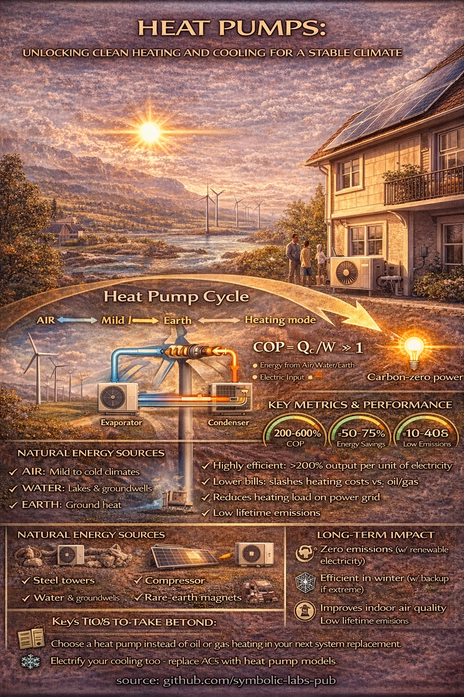

# Heat Pumps: Moving Heat, Not Making It — A Cornerstone of Climate Mitigation

Space heating, cooling, and hot water account for a large share of global energy consumption and greenhouse gas emissions, largely because they rely on direct combustion of fossil fuels. Heat pumps offer a fundamentally different approach: instead of generating heat through combustion, they move existing thermal energy from the environment into buildings using electricity. This essay explains the physical principles behind heat pumps, their materials and resource requirements, performance metrics, deployment pathways, and long-term consequences. It shows why widespread adoption of heat pumps is one of the most effective actions individuals can take to reverse climate change while improving comfort and energy security.

---

## 1. Heating as a Climate Problem

Globally, heating and cooling represent a major portion of final energy demand. Traditional systems—gas boilers, oil furnaces, and coal-based district heating—produce heat by burning fossil fuels. This approach is inherently carbon-intensive because:

* Combustion releases fossil carbon directly into the atmosphere
* Efficiency is limited by thermodynamic losses
* Emissions scale linearly with heat demand

Decarbonizing buildings therefore requires not just cleaner fuels, but a **different physical strategy** for delivering thermal comfort.

---

## 2. The Physical Principle: Heat Transfer Instead of Combustion

Heat pumps are based on **classical thermodynamics**, not chemistry.

They exploit the fact that:

* Heat naturally flows from warmer to colder regions
* With external work, heat can be moved in the opposite direction

A heat pump uses electricity to drive a closed-loop cycle that **transfers heat** from a low-temperature source to a higher-temperature sink.

### The basic cycle

1. **Evaporation:** A refrigerant absorbs heat from air, water, or ground and evaporates
2. **Compression:** An electric compressor raises the refrigerant’s pressure and temperature
3. **Condensation:** Heat is released into the building as the refrigerant condenses
4. **Expansion:** Pressure drops and the cycle repeats

No heat is created by burning fuel; it is relocated.

---

## 3. Why Heat Pumps Are So Efficient

The efficiency of a heat pump is measured by the **Coefficient of Performance (COP)**:

[
\text{COP} = \frac{\text{Heat delivered}}{\text{Electric energy input}}
]

Typical values:

* COP ≈ 3–5 under moderate conditions
* This corresponds to **300–500% efficiency** in everyday language

This does not violate physics. The extra heat comes from the environment, not from electricity. As a result, heat pumps deliver several units of heat for each unit of electrical energy consumed.

---

## 4. Natural Energy Sources for Heat Pumps

Heat pumps draw from **ubiquitous, low-grade thermal reservoirs**:

* **Air-source:** ambient outdoor air
* **Ground-source (geothermal):** stable subsurface temperatures
* **Water-source:** lakes, rivers, or groundwater

These sources are:

* Continuously replenished by solar energy and geothermal heat
* Available almost everywhere
* Not depleted by use

This makes heat pumps a renewable technology even though they run on electricity.

---

## 5. Materials and Industrial Foundations

Heat pumps are manufactured from widely used industrial materials:

* **Steel and aluminum:** structural components and heat exchangers
* **Copper:** piping and electrical windings
* **Refrigerants:** working fluids (modern systems increasingly use low–global-warming-potential options)
* **Electric motors and compressors:** mature, mass-produced technologies

These materials are globally available and largely recyclable. Unlike fossil fuels, they are **not consumed during operation**, only used to build durable equipment.

---

## 6. Performance Metrics and Climate Impact

Key performance indicators include:

* **Energy savings:** typically 50–75% compared to fossil heating
* **Lifecycle emissions:** near-zero when powered by renewable electricity
* **Operational lifetime:** 15–25+ years
* **Maintenance:** lower than combustion systems
* **Indoor air quality:** improved due to absence of combustion byproducts

As electricity grids decarbonize, the climate footprint of heat pumps automatically decreases, without modifying the device itself.

---

## 7. Installation and Commissioning

Heat pump deployment is comparatively fast and scalable.

### Typical process

1. Building assessment and sizing
2. Installation of indoor and outdoor units (or ground loop)
3. Electrical connection
4. System commissioning

Air-source systems can often be installed within days. Ground-source systems require more upfront work but offer higher seasonal efficiency and long-term stability.

Importantly, heat pumps can often replace both **heating and cooling systems**, simplifying building infrastructure.

---

## 8. Long-Term Consequences and System Effects

### Climate and energy systems

* Drastically reduces fossil fuel demand
* Shifts energy use from combustion to electricity
* Integrates naturally with solar and wind power

### Economic and social effects

* Lower operating costs
* Reduced exposure to fuel price volatility
* Increased energy security at household and national levels

### Environmental impact

* No on-site emissions
* No combustion-related air pollution
* Minimal long-lived waste

Heat pumps exemplify a transition from extractive to **circulatory energy systems**, where energy is reused rather than destroyed.

---

## 9. The Individual’s Role in Climate Reversal

For individuals, adopting a heat pump is one of the highest-impact climate actions available:

* Replacing oil or gas heating cuts emissions immediately
* Pairing heat pumps with renewable electricity approaches zero-carbon comfort
* Demand for heat pumps accelerates grid decarbonization and manufacturing scale

Unlike many climate measures, heat pumps improve everyday life: quieter operation, better comfort, cleaner air, and lower bills.

---

## Conclusion

Heat pumps demonstrate that climate mitigation does not require sacrificing comfort or efficiency. By applying basic thermodynamic principles, they deliver more heat with less energy and eliminate the need for on-site fossil combustion.

In a warming world, where both heating and cooling demands are rising, heat pumps offer a scalable, proven, and scientifically sound pathway to deep emissions reductions. Supporting their adoption is not merely an environmental choice—it is a rational alignment of human technology with the physics of energy and the limits of the climate system.

A stable climate future will be built not by burning more fuel, but by **moving heat intelligently**.

---

**source:** github.com/symbolic-labs-pub
