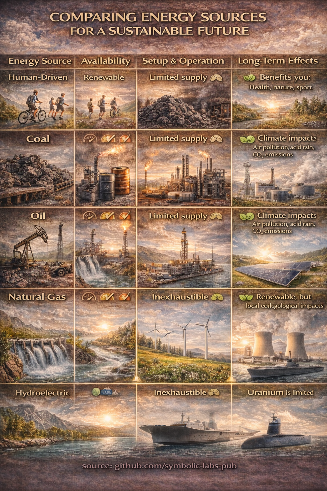
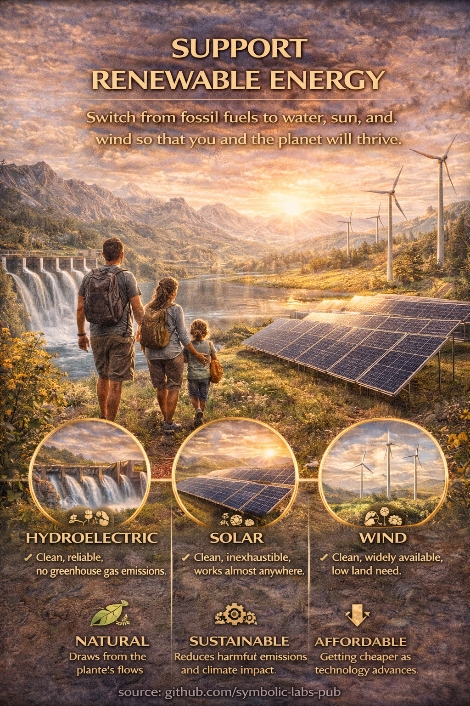
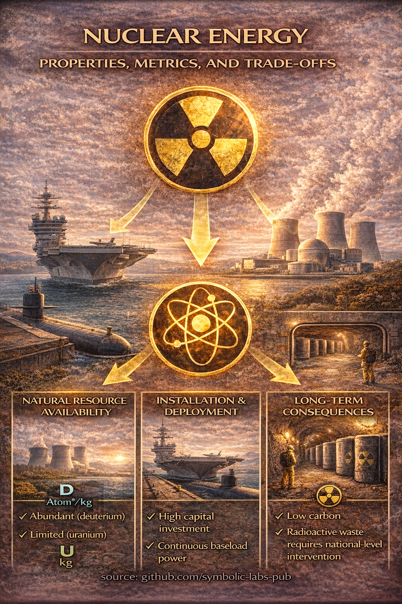
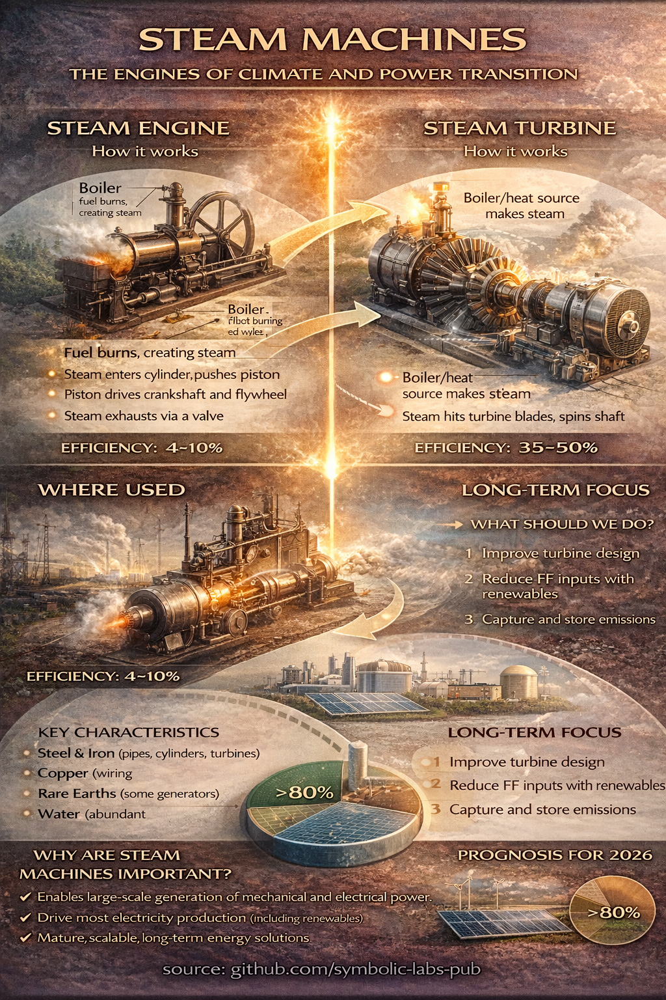
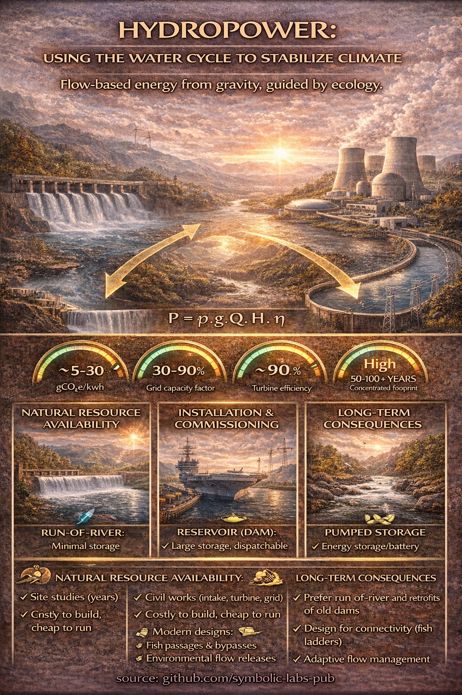
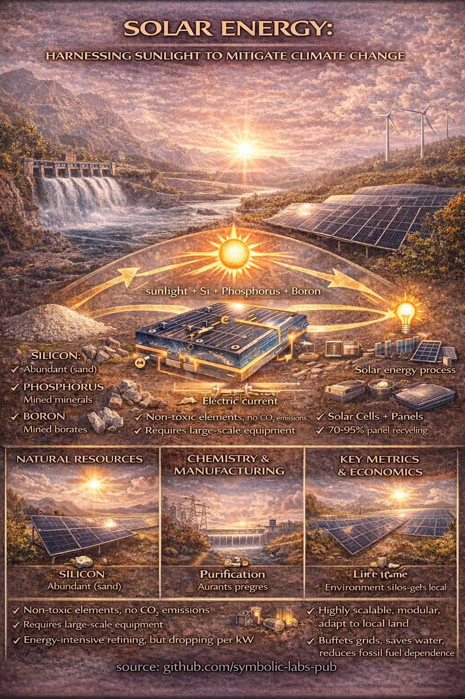
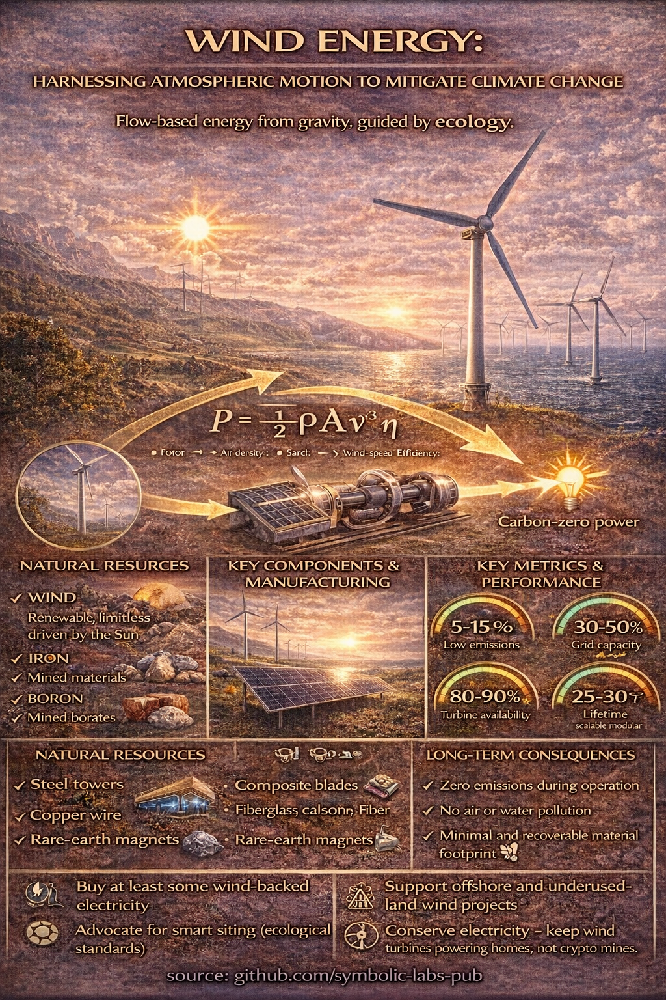
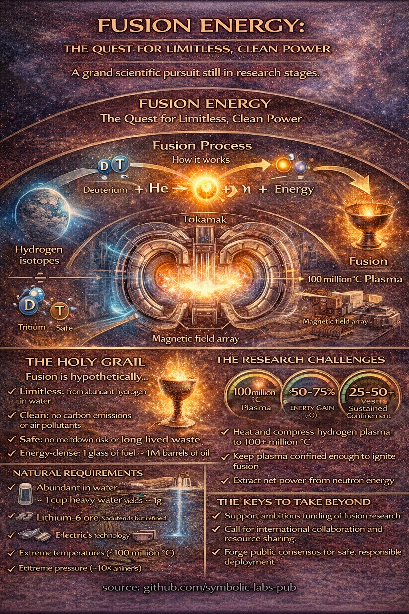
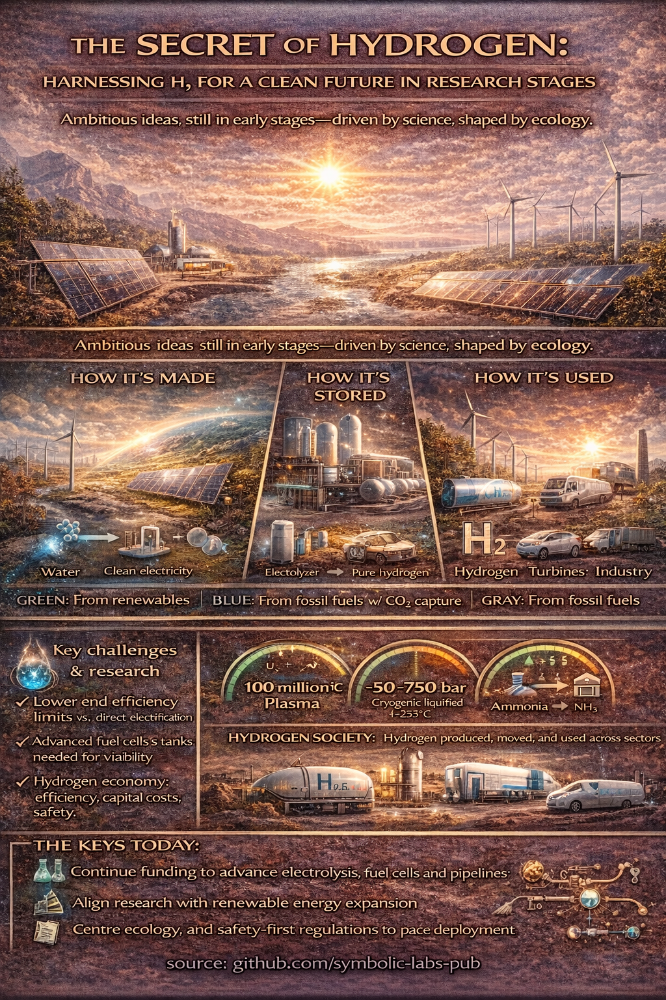

# [Energy Sources: From Human Power to Nuclear Fusion](https://github.com/symbolic-labs-pub/climate-change/tree/main/03_Energy_Sources)

Energy choices define civilization's relationship with the climate. Every watt generated either draws from finite geological stocks or harvests renewable flows—and this distinction shapes atmospheric chemistry, ecological stability, and intergenerational responsibility for centuries. This section examines energy sources through a systems lens: resource availability, carbon intensity, reversibility, and the long-term consequences that extend far beyond quarterly reports or political cycles.

---

## The Central Question

Climate stability does not require energy abstinence—it requires **energy transition**. The critical question is not "how much energy?" but "from where?" Energy sources differ along several dimensions that matter for climate:

* **Stocks vs. flows:** [Fossil fuels](03_fossil/README.md) deplete; [sun](08_solar/README.md) and [wind](09_wind/README.md) persist
* **Carbon intensity:** CO2 released per unit of useful energy
* **Reversibility:** Can impacts be undone within human timescales?
* **System lock-in:** How long do infrastructure decisions bind future choices?

Understanding these trade-offs enables informed decisions—whether by policymakers designing grids or individuals choosing how to heat their homes.

---

## In This Section

### [Comparing Energy Sources](01_sources/README.md)

A comprehensive framework for evaluating energy systems. Compares human power, fossil fuels, renewables, and nuclear across resource availability, installation requirements, ecological effects, and long-term consequences. The foundation for understanding all other topics in this section.

---

### [Human-Powered Energy](02_human/README.md)

Walking, cycling, and human muscle power. Zero-emission, health-promoting, and deeply integrated with biological limits. Explores why human power remains the cleanest form of energy for short-distance mobility.

---

### [Fossil Fuels](03_fossil/README.md)

Coal, oil, and natural gas—the energy sources that built industrial civilization and now destabilize its climate. Examines high energy density, extraction consequences, and the fundamental irreversibility of combustion emissions.

---

### [Renewable Energy](04_renewables/README.md)

Solar, wind, and hydropower as flow-based energy systems. Analyzes scalability, intermittency, land use, and ecological trade-offs. Shows why renewables align with climate goals while requiring system-level thinking.

---

### [Nuclear Fission](05_nuclear/README.md)

High-density, carbon-neutral power generation with unique temporal asymmetries. Examines uranium resources, operational characteristics, waste management horizons, and the trade-off between atmospheric risk and intergenerational stewardship.

---

### [Steam Machines](06_steam_machines/README.md)

The mechanical backbone of modern power generation. Steam turbines remain central to nuclear, geothermal, solar thermal, and biomass electricity—the climate question is not the machine, but what heats the water. Compares reciprocating engines (4-10% efficiency) with modern turbines (35-50%), examining why 19th-century physics still shapes 21st-century climate outcomes.

---

### [Hydropower](07_hydro/README.md)

The oldest large-scale renewable technology. Explores dam-based and run-of-river systems, seasonal storage, ecological impacts on river ecosystems, and the role of hydropower in grid stability.

---

### [Solar Power](08_solar/README.md)

Photovoltaic and thermal solar technologies. Covers silicon-based panels, efficiency improvements, grid integration challenges, and why solar has become the fastest-growing energy source globally.

---

### [Wind Power](09_wind/README.md)

Onshore and offshore wind energy. Examines turbine technology, capacity factors, land use efficiency, wildlife interactions, and the role of wind in decarbonizing electricity grids.

---

### [Heat Pumps](10_heat_pumps/README.md)

Moving heat instead of making it. Explains thermodynamic principles, coefficient of performance, and why heat pumps are one of the highest-impact climate technologies available to individuals. Shows how electrifying heating can cut building emissions by 50-75%.

---

### [Nuclear Fusion](11_fusion/README.md)

The "holy grail" of energy research. Examines deuterium-tritium reactions, plasma physics challenges, and why fusion remains decades away despite extraordinary promise. Clarifies fusion's role as a future backbone technology rather than an excuse to delay current action.

---

### [Hydrogen](12_hydrogen/README.md)

An energy carrier, not an energy source. Hydrogen produces no CO2 when used, but its climate value depends entirely on production method—gray (fossil), blue (with carbon capture), or green (renewable electrolysis). Best suited for hard-to-electrify sectors like steel, chemicals, and long-haul transport rather than everyday energy use.

---

## Key Insights

1. **Stocks deplete; flows persist**: [Fossil fuels](03_fossil/README.md) are finite; [solar](08_solar/README.md) and [wind](09_wind/README.md) are effectively inexhaustible
2. **Carbon intensity is not the only metric**: Reversibility, waste streams, and ecological integration matter
3. **No single source solves everything**: Climate-resilient systems combine multiple energy sources
4. **Electrification enables decarbonization**: [Heat pumps](10_heat_pumps/README.md), [EVs](../02_Travel/03_engines/README.md), and electric industry can shift energy from combustion to clean grids
5. **Time horizons vary dramatically**: Some energy choices bind societies for decades ([nuclear](05_nuclear/README.md)) or millennia (waste)

---

## Current Context (early 2026)

Global energy emissions reached a record 38.1 GtCO2 in early 2026, pushing atmospheric CO2 to 425.7 ppm—52% above pre-industrial levels. The remaining carbon budget for 1.5°C warming is approximately 170 GtCO2, equivalent to roughly four years at current emission rates.

Yet the energy transition is accelerating. [Solar](08_solar/README.md) and [wind](09_wind/README.md) now provide the cheapest new electricity in most markets. [Heat pump](10_heat_pumps/README.md) installations are growing rapidly. [Electric vehicle](../02_Travel/03_engines/README.md) adoption is reshaping transportation. The question is no longer whether energy systems will change, but whether they will change fast enough.

Understanding energy sources—their physics, their trade-offs, their long-term consequences—is essential for navigating this transition wisely.

---

| | |
|:--|--:|
| [< previous \| Travel Green](../02_Travel/04_scene/README.md) | [Comparing Energy Sources \| next >](01_sources/README.md) |

---

**source:** [github.com/symbolic-labs-pub](https://github.com/symbolic-labs-pub) at early 2026
