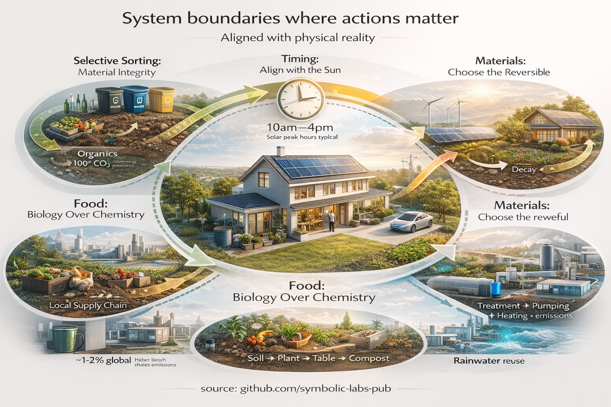
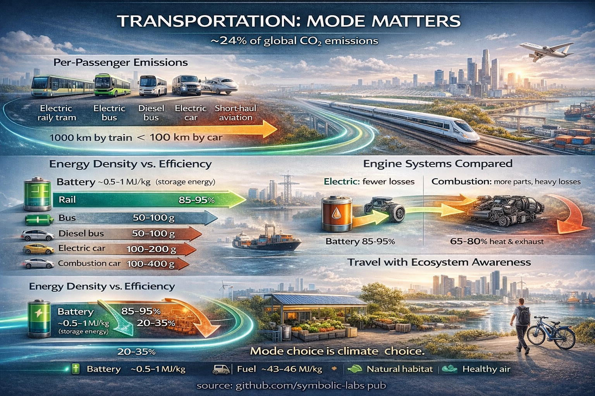
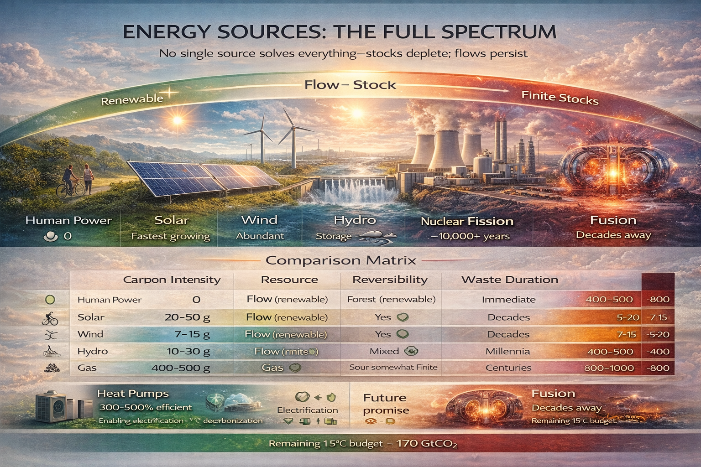

# [Understanding Climate Change: Systems, Actions, and Solutions](https://github.com/symbolic-labs-pub/climate-change)

[Climate change](00_Climate/02_what_is) is the defining challenge of the 21st century. In early 2026, atmospheric CO2 reached 425.7 ppm—52% above pre-industrial levels—while fossil fuel emissions hit a record 38.1 billion tonnes. The remaining carbon budget to limit warming to 1.5°C stands at approximately 170 GtCO2, equivalent to roughly four years at current emission rates. These numbers are not abstractions; they describe physical processes that will shape ecosystems, economies, and human societies for centuries.

Yet climate change is not an unsolvable problem. It is a systems failure—and systems can be redesigned. This repository explores how individuals, communities, and institutions can align their actions with physical reality rather than rely on symbolic gestures. It examines climate through three interconnected domains: what we do at home, how we travel, and where our energy comes from.

---

## The Three Pillars

[Climate](00_Climate/01_cycles) action operates across multiple scales, but individual influence concentrates at specific boundaries where personal decisions intersect with physical systems. This repository organizes climate understanding into three domains:

---

### [At Home: Individual Climate Actions](01_At_Home/)

The home is where individual choices most directly affect material and energy flows. This section examines five key intervention points:

- **[Selective waste sorting](01_At_Home/01_why_selective_trash/)** — preserving material integrity for recycling
- **[Timing energy use](01_At_Home/02_use_appliances_at_sunlight/)** — aligning consumption with solar generation peaks
- **[Organic and local food](01_At_Home/03_go_organic/)** — reducing fossil nitrogen dependency
- **[Natural materials](01_At_Home/04_prefer_natural_materials/)** — avoiding irreversible microplastic pollution
- **[Water conservation](01_At_Home/05_treasure_water/)** — understanding the energy embedded in every liter

These actions work not because they are virtuous, but because they reduce pressure on systems already operating beyond sustainable limits.

---

### [Travel: Moving People and Goods](02_Travel/)

Transportation accounts for approximately 24% of global CO2 emissions and is one of the fastest-growing emission sources. This section analyzes mobility through the lens of physics:

- **[Transport modes](02_Travel/01_transport/)** — comparing rail, bus, car, and aviation by efficiency
- **[Energy density](02_Travel/02_energy/)** — why batteries work for cars but not yet for planes
- **[Engine systems](02_Travel/03_engines/)** — thermodynamic efficiency of combustion vs. electric motors
- **[Sustainable travel](02_Travel/04_scene/)** — ecological dimensions of how we move
- **[Turbine technology](03_Energy_Sources/06_steam_machines/)** — engineering perspectives on propulsion

Mode choice often matters more than distance traveled. A 1,000 km train journey can emit less than a 100 km car trip.

---

### [Energy Sources: Power Generation](03_Energy_Sources/)

Every energy choice shapes climate trajectories across timescales from seconds to millennia. This section compares energy systems from human power to nuclear fusion:

- **[Source comparison](03_Energy_Sources/01_sources/)** — stocks vs. flows, carbon intensity, reversibility
- **[Human power](03_Energy_Sources/02_human/)** — zero-emission mobility within biological limits
- **[Fossil fuels](03_Energy_Sources/03_fossil/)** — high density, irreversible atmospheric release
- **[Renewables](03_Energy_Sources/04_renewables/)** — [solar](03_Energy_Sources/08_solar/), [wind](03_Energy_Sources/09_wind/), and [hydro](03_Energy_Sources/07_hydro/) as flow-based systems
- **[Nuclear fission](03_Energy_Sources/05_nuclear/)** — carbon-neutral with intergenerational responsibilities
- **[Heat pumps](03_Energy_Sources/10_heat_pumps/)** — moving heat instead of making it
- **[Hydrogen](03_Energy_Sources/12_hydrogen/)** — energy carrier for hard-to-electrify sectors
- **[Fusion](03_Energy_Sources/11_fusion/)** — the long-term promise and current limitations

Understanding these trade-offs enables informed choices about the energy systems that will power the 21st century.

---

## Key Principles

This repository is built on several analytical foundations:

1. **Physics over intentions**: Climate outcomes depend on energy flows and material cycles, not on beliefs or symbols
2. **Systems thinking**: Individual actions matter most where they reduce pressure on stressed systems
3. **Reversibility matters**: Some impacts can be undone; others cannot. Prefer the former.
4. **Time horizons vary**: Some decisions bind for years, others for generations
5. **Solutions already exist**: Most necessary technologies are mature and deployable now

---

## Current Climate Context (early 2026)

| Metric | Value | Significance |
|--------|-------|--------------|
| Atmospheric CO2 | 425.7 ppm | 52% above pre-industrial (278 ppm) |
| Annual fossil emissions | 38.1 GtCO2 | Record high, +1.1% from 2024 |
| Total annual emissions | ~42 GtCO2 | Including land use change |
| Remaining 1.5°C budget | ~170 GtCO2 | ~4 years at current rates |
| Ocean carbon sink | 29% of emissions | Declining efficiency |
| Global temperature | 2nd/3rd warmest year | Continuing exceptional trend |

The physics of climate change cannot be negotiated. But the choices we make—individually and collectively—determine whether we stabilize the climate system or continue destabilizing it.

---

## How to Use This Repository

Each section can be read independently, but they interconnect. Energy choices affect both home and travel. Transportation determines urban form and thus home energy demand. Material choices at home influence industrial energy consumption.

Navigate by interest:
- **Start with systems thinking**: [Comparing Energy Sources](03_Energy_Sources/01_sources/)
- **Focus on personal action**: [At Home](01_At_Home/)
- **Understand transportation**: [Travel](02_Travel/)
- **Explore specific technologies**: [Heat pumps](03_Energy_Sources/10_heat_pumps/), [solar](03_Energy_Sources/08_solar/), [EVs](02_Travel/03_engines/) in their respective sections

---

## Conclusion

Climate stability is not achieved by perfection, but by coordination with reality. The atmosphere does not respond to intentions—only to emissions. The ecosystems we depend on do not care about our values—only about the pressures we place on them.

This repository offers a framework for understanding where individual and collective choices intersect with planetary systems. The future depends less on what we promise, and more on how well we understand the flows we are already part of.

---

| | |
|:--|--:|
| | [At Home \| next >](01_At_Home/) |

---

**source:** [github.com/symbolic-labs-pub](https://github.com/symbolic-labs-pub) at early 2026
